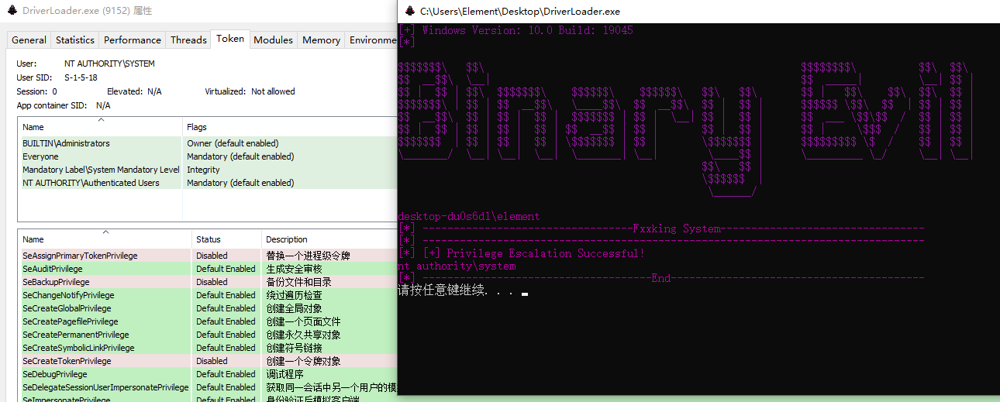
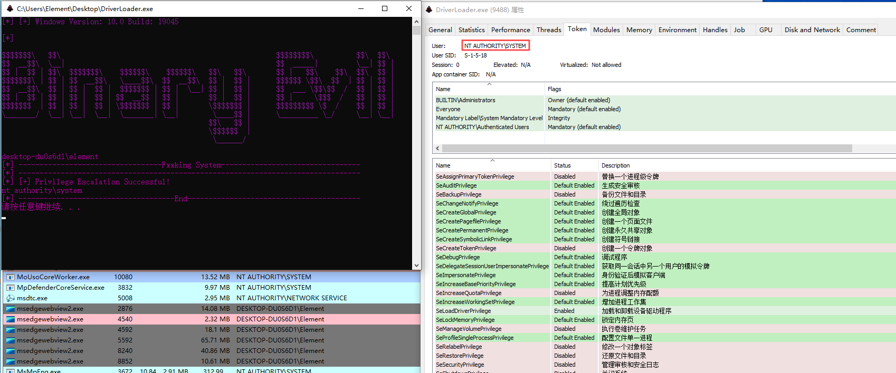
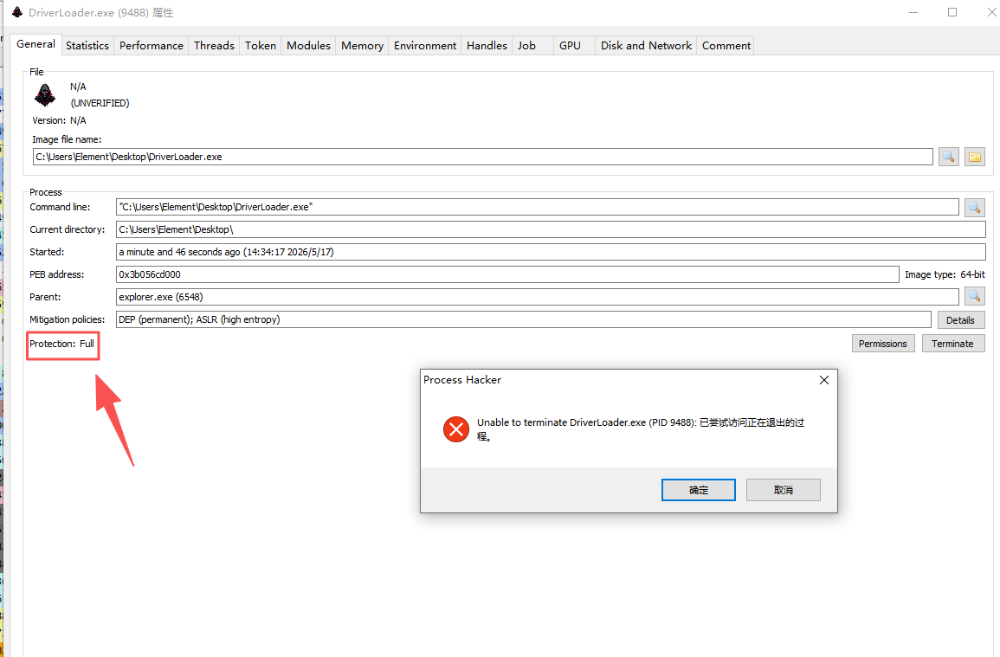
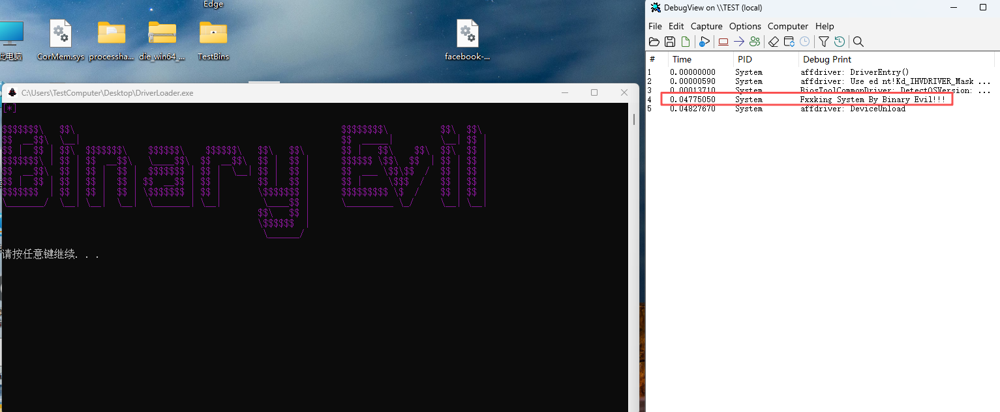

# Using Vulnerability Driver(CorMem.sys)

Privilege escalation was successfully achieved using the CorMem.sys(Physical Memory Read/Write) vulnerable driver, as shown in the figure below.




Add BiosToolCommonDriver.sys

Privilege escalation



PPL




Kill Process
```
DriverLoader.exe <kill processid>
```
开启核晶的*60


* 新增了VirtualToPhysical的函数
**代码来源于redteamfortress（https://github.com/redteamfortress）的项目PPLShade（https://github.com/redteamfortress/PPLShade）**

**The code is derived from the PPLShade project（https://github.com/redteamfortress/PPLShade）, which is authored by redteamfortress（https://github.com/redteamfortress）. Further information on this project can be found on the redteamfortress GitHub page.**


Loader mapping driver


**代码已经更新**


add commandline 


dmp lsass (不支持Windows 11新版本)

build


remove process protect 


dmp file  
  


**Update DriverSelector**  
**Just switch the BYOVD driver you want to use in the DriverSelector file.**   
只要在文件DriverSelector切换你想使用的漏洞驱动即可，注意相应的类型。  


## Syscall
使用了[SysWhispers4](https://github.com/JoasASantos/SysWhispers4)加入到了本项目

Special thanks to the author of [SysWhispers4](https://github.com/JoasASantos/SysWhispers4) for sharing this project.


# 个人DIY
修改了UTF-8编码，解决了运行时中文乱码的问题，修改了提权逻辑，如果提权位输入PID，则新开启SYSTEM权限的cmd，感谢原作者提供优质代码以供参考学习。
